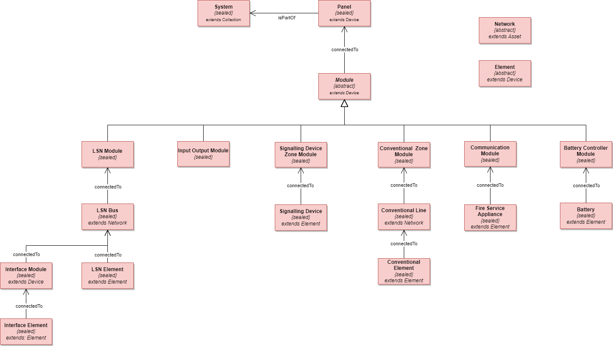

# Industry Alliance Partnerships

I am actively engaged in partnerships with several partners such as [Microsoft](https://azure.microsoft.com/), [Amazon](https://aws.amazon.com/), [Apple](https://www.apple.com/wallet/), [Auto-Desk](https://aps.autodesk.com/), [Conplement](https://www.conplement.de/), [Rexroth](https://apps.boschrexroth.com/microsites/ctrlx-automation/en/), [Archilogic](https://www.archilogic.com/), [Distech Controls](https://www.distech-controls.com/), [Kontakt.io](https://kontakt.io/), [Thing-IT](https://www.thing-it.com/), [Wirepas](https://www.wirepas.com/products/how-it-works), [Yanzi](https://www.yanzi.se/), and several others.

I am responsible for evaluating the various products and services offered by the partners, then work on low-fidelity and high-fidelity prototypes to evaluate the technology. Finally, induct the selected technology into our product services.

# Patents

I hold the patent **“Anomaly detection based on cross-domain data, learning algorithms and Digital Twin”**. This technology is being used in several of our IoT Business Services in NEXOSPACE.

I have also filed for **two more patents** which are currently being processed.

# Bosch Building Technologies Ontology Central

https://www.boschbuildingsolutions.com/xc/en/news-and-stories/building-ontologies/

https://github.com/boschglobal/building-technologies-ontology-central

I am the author of the Bosch Building Technologies Ontology Central which contains ontology models relevant for commercial buildings. Currently Foundation Ontology, Fire Alarm Systems Ontology and HVAC Systems Ontology have been open sourced. Ontologies related to other BT domains are being worked on and will be open sourced soon.

## Foundation Ontology

https://github.com/boschglobal/building-technologies-ontology-central/tree/main/com/bosch/bt/Foundation/2.0.0

The **foundation ontology** is the digital common foundation layer (a shared domain kernel) of [Bosch Building Technologies](https://www.boschbuildingtechnologies.com/xc/en/) domain ontology models. All the common aspects for a building digital twin are defined by this **foundation ontology**. This **foundation ontology** allows cross domain (service) considerations and enables a dynamic extension point for a `Digital Twin` by using roles.

The diagram below shows the `Core` of the **foundation ontology** the set of core models with their relationships.

## Fire Alarm System Ontology

https://github.com/boschglobal/building-technologies-ontology-central/blob/main/com/bosch/bt/fire-alarm-systems/2.0.0

The Fire Alarm Systems Ontology is based on the Bosch Foundation Ontology and uses the foundation concepts of `Zone`, `Asset`, `DataPoint` and `Collection`.

The diagram below shows the core elements of the fire ontology, the foundation concepts like points are not shown.

## HVAC System Ontology

https://github.com/boschglobal/building-technologies-ontology-central/blob/main/com/bosch/bt/hvac-systems/2.0.0

HVAC system ontology to describe  HVAC entities like  `Dampers`, `Pumps`, `Thermal Distributors` (e.g. `AHU`), `Thermal Exchanger`, and `Thermal Sources` (e.g. `Chillers`).

The diagram below shows the core elements of the HVAC system, the foundation concepts like points are not shown.

