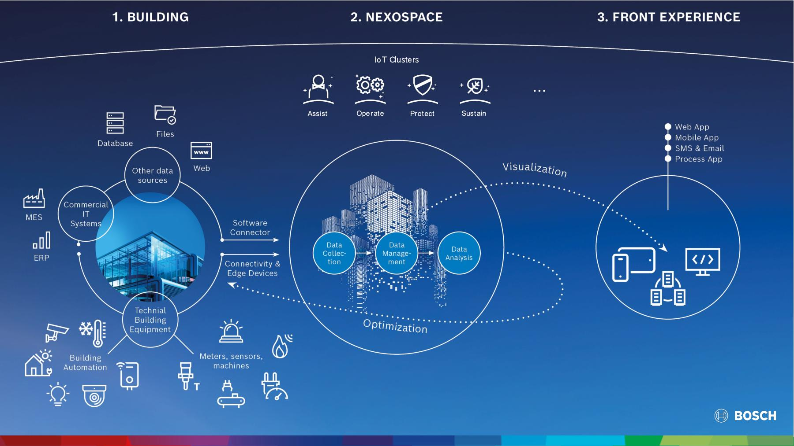
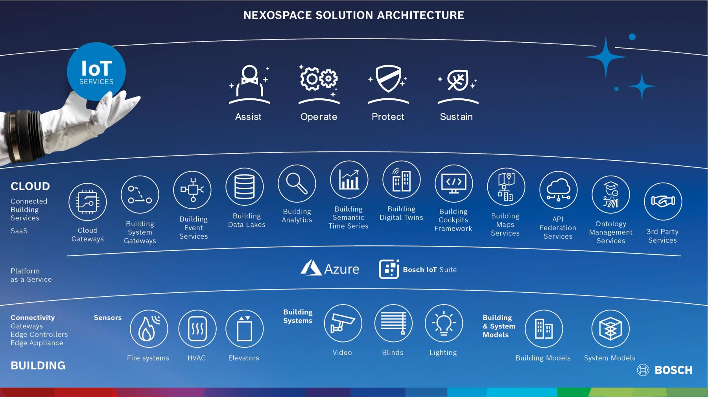
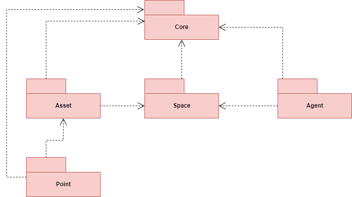
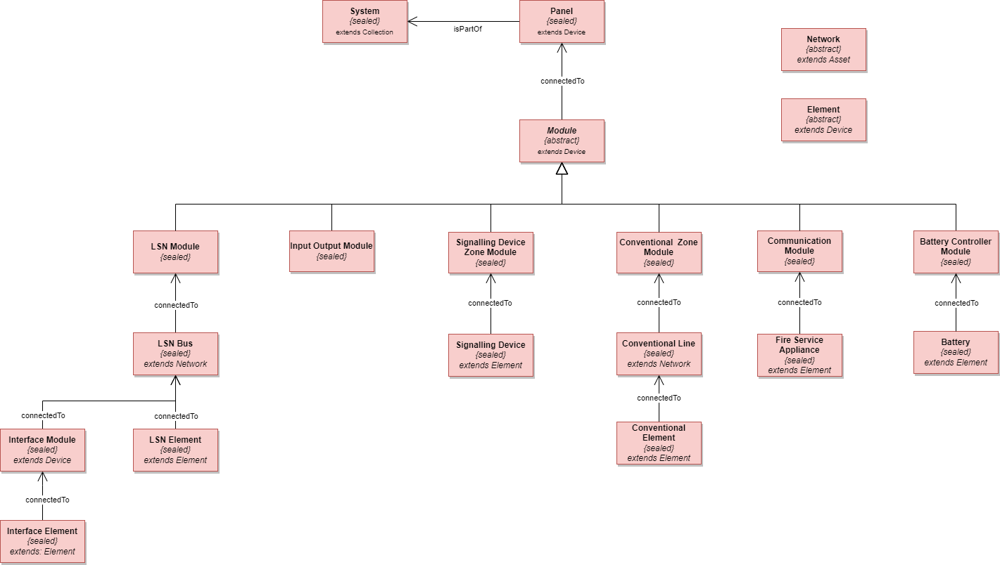
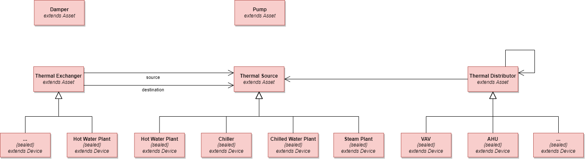

# Profile

<h1>ALWAR MANDYAM</h1>
<h2>Senior Solution Architect</h2>

**Leader** & **manager** with around **two decades** of experience in designing and building **platforms**, **applications**, **services**, and **solutions**.
 
Expertise in the areas of **architecture**, **cloud technologies**, and **IoT services**.
 
Specialized in **large-scale software development** and **public cloud solutions**, including designing, and implementing these services/solutions.
 
Ability to effectively deliver solutions that align with the goals of **risk mitigation**, **cost savings**, and **ROI**.
 
Proven **international collaborator**, fostering success in diverse cultural settings.
 
I code, write, speak, empower, promote, learn, and listen.

# PERSONAL DETAILS

  <table>
    <tr>
      <td></td>
      <td>German Citizen</td>
    </tr>
    <tr>
      <td></td>
      <td>Munich, Germany</td>
    </tr>
    <tr>
      <td></td>
      <td>+49 152 21866859</td>
    </tr>
    <tr>
      <td></td>
      <td><a href="https://profile.alwarmandyam.net/">https://profile.alwarmandyam.net</a></td>
    </tr>
    <tr>
      <td></td>
      <td><a href="mailto:alwarmb@gmail.com">alwarmb@gmail.com</a></td>
    </tr>
    <tr>
      <td></td>
      <td><a href="https://www.linkedin.com/in/alwarmb/">https://www.linkedin.com/in/alwarmb/</a></td>
    </tr>
  </table>

## Languages

|Language|Proficiency|
|--        |--                               |
|English   |_Fluent_                         |
|German    |_Conversational (B1 Certified)_  |
|Kannada   |_Fluent_                         |
|Tamil     |_Fluent_                         |
|Hindi     |_Conversational_                 |

# EDUCATION

## Bachelor of Engineering

### Jawaharlal Nehru National College of Engineering

http://jnnce.ac.in/

**Visvesvaraya Technological University**
 
https://vtu.ac.in/en/

Bachelor of Engineering – Electronics & Communication
 
http://jnnce.ac.in/jnndemo/deptece.html

>From `08.2002` to `07.2006`

Achieved **First Class with Distinction** in each of the eight semesters of the bachelor’s degree.  Successfully completed project work on latest technology vis-a-vis **Identification using Biometrics**

# WORK EXPERIENCE

## Bosch Building Technologies

  <table>
    <tr>
      <td>Position</td>
      <td><b>Senior Solution Architect</b></td>
    </tr>
    <tr>
      <td>Location</td>
      <td>Munich, Germany</td>
    </tr>
    <tr>
      <td>Duration</td>
      <td>From <b>07.2015</b> to <b>Present</b></td>
    </tr>
  </table>

Bosch BT is an experienced system integrator helping buildings to be more secure, more efficient, and more comfortable.
Bosch BT mainly serves the domains such as video surveillance, intrusion detection, access control, fire detection, conferencing systems, and building automation systems.

[Projects at Bosch](./projects-at-bosch.md)

## Bosch Security Systems

  <table>
    <tr>
      <td>Position</td>
      <td><b>Senior Software Engineer</b></td>
    </tr>
    <tr>
      <td>Location</td>
      <td>Singapore</td>
    </tr>
    <tr>
      <td>Duration</td>
      <td>From <b>08.2010</b> to <b>06.2015</b></td>
    </tr>
  </table>

Bosch BT is an experienced system integrator helping buildings to be more secure, more efficient, and more comfortable.

Bosch BT mainly serves the domains such as video surveillance, intrusion detection, access control, fire detection, conferencing systems, and building automation systems.

[Projects at Bosch](./projects-at-bosch.md)

## Tyco Fire and Security Pvt. Ltd.

  <table>
    <tr>
      <td>Position</td>
      <td><b>Software Engineer</b></td>
    </tr>
    <tr>
      <td>Location</td>
      <td>Bangalore, India</td>
    </tr>
    <tr>
      <td>Duration</td>
      <td>From <b>11.2008</b> to <b>07.2010</b></td>
    </tr>
  </table>

Tyco is a leading provider of security products and services, fire protection and detection products and services, valves and controls, and other industrial products.

[Projects at Tyco](./projects-at-tyco.md)

## Keane Inc.

  <table>
    <tr>
      <td>Position</td>
      <td><b>Software Engineer</b></td>
    </tr>
    <tr>
      <td>Location</td>
      <td>Bangalore, India</td>
    </tr>
    <tr>
      <td>Duration</td>
      <td>From <b>08.2006</b> to <b>10.2008</b></td>
    </tr>
  </table>

Keane is a U.S. software services company delivering strategy, application management and development through delivery centers in India

[Projects at Keane](./projects-at-keane.md)

# TECHNOLOGY EXPERTISE

- [Solution Architecture](solution-architecture.md)
  - [arc42 - Software Architecture Methodology](arc42-methodology.md)
- [Software Architecture](software-architecture.md)
- [Azure Services](azure-services.md)

# ROLES & RESPONSIBILITIES

## BT Architecture Engineering Group (BTARCET)

Active member of the BTARCET which sets the architectural constraints, rules, concepts, and standards to be adhered to by the engineering and IT teams. My responsibilities included:
-	Definition of the BT 4.0 target architectures end-to-end.
-	Software, system, solution and services architecture designs and reviews.
-	Software and system architectures for the various domain specific contexts.
-	Service architectures based on the reference architecture.
-	Coaching & mentoring service for the business lines solution architects.
-	Industry architecture and technology scouting.
-	Industry alliance partnership ignitions and management.
-	Technology selections and proof of concept definitions, design, and realization.
-	Inner source culture driven architecture community exchanges and empowerment.
-	Defining standards and benchmark KPIs (Example. BT 4.0 readiness index: bronze, silver, gold).
-	Checkpoints / controlling / governance community sessions.

## Solution Architect for NEXOSPACE Digital Services

https://www.boschbuildingsolutions.com/xc/en/digital-services/

NEXOSPACE, orchestrates the optimal interaction of the building's technical equipment in real time. Data from the various building service systems are brought together and analysed. In combination with a digital twin, this creates a completely new, holistic view of the building.

<iframe width="560" height="315" src="https://www.youtube.com/embed/Vow4mhO_pEc" title="Light + Building 2022: NEXOSPACE Launch Event - Digitale Services für das Gebäudemanagement" frameborder="0" allow="accelerometer; autoplay; clipboard-write; encrypted-media; gyroscope; picture-in-picture; web-share" allowfullscreen></iframe>

<iframe width="560" height="315" src="https://www.youtube.com/embed/hZ0wqachONQ" title="Launch 'Digital Service Suite' NEXOSPACE: with Andreas Mauer - CTO Bosch Building Technologies" frameborder="0" allow="accelerometer; autoplay; clipboard-write; encrypted-media; gyroscope; picture-in-picture; web-share" allowfullscreen></iframe>

### Nexospace Foundation Services

Foundation Services include the following Software-as-a-Service (SaaS) capabilities:

- Cloud Gateways
- Building System Gateways
- Building Event Services
- Building DataLakes
- Building Analytics
- Building Semantic Time Series
- Building Digital Twins
- Building Cockpit Framework
- Building Map Services
- API Federation Services
- Ontology Management Services

## Alliance Partner for Bosch Corporate Research

As alliance partner between Bosch BT and Bosch CR, my responsibilities include:
-	Selecting of field of research for the CR team.
-	Consulting and decision making to nudge the project in the desired direction.
-	Conducting project status reviews and providing meaningful feedback.
-	Incorporating results of the project into active service products.

## Co-host of DevOps Service Hub (DOSH) Conference

https://www.linkedin.com/search/results/all/?keywords=%23doshconf

The DOSH conference aims to bring together developers and software architects, to work on common topics and to shape the future of Bosch Building Technologies together. The conference is held during the summer every year and presentations are given by Bosch colleagues as well as external partners such as Microsoft, Apple, Auto-Desk, Rexroth etc.

## Hack Coach at Bosch Connected Experience (BCX)

https://bosch-connected-world.com/hackathon/

As a hack coach at BCX, I consult the participating teams in several aspects such as: ideation, technology selection, prototype implementation, story-telling preparation, initial review.

# ACHIEVEMENTS

## Industry Alliance Partnerships

I am actively engaged in partnerships with several partners such as [Microsoft](https://azure.microsoft.com/), [Amazon](https://aws.amazon.com/), [Apple](https://www.apple.com/wallet/), [Auto-Desk](https://aps.autodesk.com/), [Conplement](https://www.conplement.de/), [Rexroth](https://apps.boschrexroth.com/microsites/ctrlx-automation/en/), [Archilogic](https://www.archilogic.com/), [Distech Controls](https://www.distech-controls.com/), [Kontakt.io](https://kontakt.io/), [Thing-IT](https://www.thing-it.com/), [Wirepas](https://www.wirepas.com/products/how-it-works), [Yanzi](https://www.yanzi.se/), and several others.

I am responsible for evaluating the various products and services offered by the partners, then work on low-fidelity and high-fidelity prototypes to evaluate the technology. Finally, induct the selected technology into our product services.

## Patents

I hold the patent **“Anomaly detection based on cross-domain data, learning algorithms and Digital Twin”**. This technology is being used in several of our IoT Business Services in NEXOSPACE.

I have also filed for **two more patents** which are currently being processed.

## Bosch Building Technologies Ontology Central

https://www.boschbuildingsolutions.com/xc/en/news-and-stories/building-ontologies/

https://github.com/boschglobal/building-technologies-ontology-central

I am the author of the Bosch Building Technologies Ontology Central which contains ontology models relevant for commercial buildings. Currently Foundation Ontology, Fire Alarm Systems Ontology and HVAC Systems Ontology have been open sourced. Ontologies related to other BT domains are being worked on and will be open sourced soon.

### Foundation Ontology

https://github.com/boschglobal/building-technologies-ontology-central/tree/main/com/bosch/bt/Foundation/2.0.0

The **foundation ontology** is the digital common foundation layer (a shared domain kernel) of [Bosch Building Technologies](https://www.boschbuildingtechnologies.com/xc/en/) domain ontology models. All the common aspects for a building digital twin are defined by this **foundation ontology**. This **foundation ontology** allows cross domain (service) considerations and enables a dynamic extension point for a `Digital Twin` by using roles.

The diagram below shows the `Core` of the **foundation ontology** the set of core models with their relationships.

### Fire Alarm System Ontology

https://github.com/boschglobal/building-technologies-ontology-central/blob/main/com/bosch/bt/fire-alarm-systems/2.0.0

The Fire Alarm Systems Ontology is based on the Bosch Foundation Ontology and uses the foundation concepts of `Zone`, `Asset`, `DataPoint` and `Collection`.

The diagram below shows the core elements of the fire ontology, the foundation concepts like points are not shown.

### HVAC System Ontology

https://github.com/boschglobal/building-technologies-ontology-central/blob/main/com/bosch/bt/hvac-systems/2.0.0

HVAC system ontology to describe  HVAC entities like  `Dampers`, `Pumps`, `Thermal Distributors` (e.g. `AHU`), `Thermal Exchanger`, and `Thermal Sources` (e.g. `Chillers`).

The diagram below shows the core elements of the HVAC system, the foundation concepts like points are not shown.

