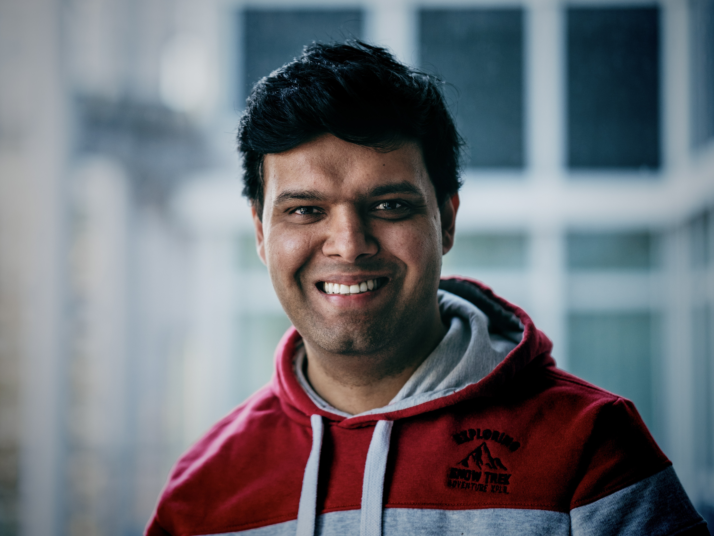

# Profile

<h1>ALWAR MANDYAM</h1>
<h2>Senior Solution Architect</h2>

**Leader** & **manager** with around **two decades** of experience in designing and building **platforms**, **applications**, **services**, and **solutions**.
 
Expertise in the areas of **architecture**, **cloud technologies**, and **IoT services**.
 
Specialized in **large-scale software development** and **public cloud solutions**, including designing, and implementing these services/solutions.
 
Ability to effectively deliver solutions that align with the goals of **risk mitigation**, **cost savings**, and **ROI**.
 
Proven **international collaborator**, fostering success in diverse cultural settings.
 
I code, write, speak, empower, promote, learn, and listen.

# PERSONAL DETAILS

  <table>
    <tr>
      <td></td>
      <td>German Citizen</td>
    </tr>
    <tr>
      <td></td>
      <td>Munich, Germany</td>
    </tr>
    <tr>
      <td></td>
      <td>+49 152 21866859</td>
    </tr>
    <tr>
      <td></td>
      <td><a href="https://profile.alwarmandyam.net/">https://profile.alwarmandyam.net</a></td>
    </tr>
    <tr>
      <td></td>
      <td><a href="mailto:alwarmb@gmail.com">alwarmb@gmail.com</a></td>
    </tr>
    <tr>
      <td></td>
      <td><a href="https://www.linkedin.com/in/alwarmb/">https://www.linkedin.com/in/alwarmb/</a></td>
    </tr>
  </table>

## Languages

|Language|Proficiency|
|--        |--                               |
|English   |_Fluent_                         |
|German    |_Conversational (B1 Certified)_  |
|Kannada   |_Fluent_                         |
|Tamil     |_Fluent_                         |
|Hindi     |_Conversational_                 |

# EDUCATION

## Bachelor of Engineering

### Jawaharlal Nehru National College of Engineering

http://jnnce.ac.in/

**Visvesvaraya Technological University**
 
https://vtu.ac.in/en/

Bachelor of Engineering – Electronics & Communication
 
http://jnnce.ac.in/jnndemo/deptece.html

>From `08.2002` to `07.2006`

Achieved **First Class with Distinction** in each of the eight semesters of the bachelor’s degree.  Successfully completed project work on latest technology vis-a-vis **Identification using Biometrics**

# WORK EXPERIENCE

## Bosch Building Technologies

  <table>
    <tr>
      <td>Position</td>
      <td><b>Senior Solution Architect</b></td>
    </tr>
    <tr>
      <td>Location</td>
      <td>Munich, Germany</td>
    </tr>
    <tr>
      <td>Duration</td>
      <td>From <b>07.2015</b> to <b>Present</b></td>
    </tr>
  </table>

Bosch BT is an experienced system integrator helping buildings to be more secure, more efficient, and more comfortable.
Bosch BT mainly serves the domains such as video surveillance, intrusion detection, access control, fire detection, conferencing systems, and building automation systems.

### Projects at Bosch

[Projects at Bosch](projects-at-bosch)
-	[NEXOSPACE Foundation Services](projects-at-bosch#nexospace-foundations-services)
-	[Fire System Analyzer (FSA)](projects-at-bosch#fire-system-analyzer-fsa)
-	[Remote Services - Next Gen](projects-at-bosch#remote-services---next-gen)
-	[Bosch Energy Services](projects-at-bosch#bosch-energy-services)
-	[Facility Management Assistant](projects-at-bosch#facility-management-assistant)
-	[Bosch Video Management System](projects-at-bosch#bosch-video-management-system)
-	[Project Endeavour](projects-at-bosch#project-endeavour)
-	[Building Integration System (BIS)](projects-at-bosch#building-integration-system-bis)

## Bosch Security Systems

  <table>
    <tr>
      <td>Position</td>
      <td><b>Senior Software Engineer</b></td>
    </tr>
    <tr>
      <td>Location</td>
      <td>Singapore</td>
    </tr>
    <tr>
      <td>Duration</td>
      <td>From <b>08.2010</b> to <b>06.2015</b></td>
    </tr>
  </table>

Bosch BT is an experienced system integrator helping buildings to be more secure, more efficient, and more comfortable.

Bosch BT mainly serves the domains such as video surveillance, intrusion detection, access control, fire detection, conferencing systems, and building automation systems.

[Projects at Bosch](./projects-at-bosch.md)

### Projects at Bosch

[Projects at Bosch](projects-at-bosch)
-	[NEXOSPACE Foundation Services](projects-at-bosch#nexospace-foundations-services)
-	[Fire System Analyzer (FSA)](projects-at-bosch#fire-system-analyzer-fsa)
-	[Remote Services - Next Gen](projects-at-bosch#remote-services---next-gen)
-	[Bosch Energy Services](projects-at-bosch#bosch-energy-services)
-	[Facility Management Assistant](projects-at-bosch#facility-management-assistant)
-	[Bosch Video Management System](projects-at-bosch#bosch-video-management-system)
-	[Project Endeavour](projects-at-bosch#project-endeavour)
-	[Building Integration System (BIS)](projects-at-bosch#building-integration-system-bis)

## Tyco Fire and Security Pvt. Ltd.

  <table>
    <tr>
      <td>Position</td>
      <td><b>Software Engineer</b></td>
    </tr>
    <tr>
      <td>Location</td>
      <td>Bangalore, India</td>
    </tr>
    <tr>
      <td>Duration</td>
      <td>From <b>11.2008</b> to <b>07.2010</b></td>
    </tr>
  </table>

Tyco is a leading provider of security products and services, fire protection and detection products and services, valves and controls, and other industrial products.

### Projects at Tyco

[Projects at Tyco](projects-at-tyco)
-	[C•CURE 9000](projects-at-tyco#ccure-9000)
-	[DMP Intrusion Panel & Galaxy Intrusion Panel (by Honeywell) Integration](projects-at-tyco#dmp-intrusion-panel--galaxy-intrusion-panel-by-honeywell-integration)
-	[iStar Controller Simulator](projects-at-tyco#istar-controller-simulator)
-	[Bosch Video Integration](projects-at-tyco#bosch-video-integration)

## Keane Inc.

  <table>
    <tr>
      <td>Position</td>
      <td><b>Software Engineer</b></td>
    </tr>
    <tr>
      <td>Location</td>
      <td>Bangalore, India</td>
    </tr>
    <tr>
      <td>Duration</td>
      <td>From <b>08.2006</b> to <b>10.2008</b></td>
    </tr>
  </table>

Keane is a U.S. software services company delivering strategy, application management and development through delivery centers in India

### Projects at Keane

[Projects at Keane](projects-at-keane)
-	[Unisys – Client Satisfaction & Incident Survey (CSIS)](projects-at-keane#unisys--client-satisfaction--incident-survey-csis)
-	[Merrill Lynch Security and Provisioning Framework](projects-at-keane#merrill-lynch-security-and-provisioning-framework)
-	[Unisys InfoImage](projects-at-keane#unisys-infoimage)

# TECHNOLOGY EXPERTISE

## Solution Architecture

Solution architecture is a practice to provide ground for software development projects by tailoring IT solutions to specific business needs and defining their functional requirements and stages of implementation. Solution architecture is the means to execute or realise a technology strategy.

In this section you will find solution architecture diagrams and technology descriptions for reference architectures, real world examples of cloud architectures, and solution ideas for common workloads.

- [Solution Architecture](solution-architecture.md)
  - [Solution Architecture Snippets](solution-architecture#solution-architecture-snippets)
  - [arc42 - Software Architecture Methodology](arc42-methodology.md)

## Software Architecture

The software architecture of a system serves as a blueprint for a system and depicts the system’s organization or structure and provides an explanation of how it behaves. A system represents the collection of components that accomplish a specific function or set of functions. Hence, software architecture provides an abstraction to manage the system complexity and establish a communication and coordination mechanism among components.

Software design is the process of conceptualizing the software requirements into software implementation. This is the initial phase within the software development life cycle (SDLC) — shifting the concentration from the problem to the solution.

- [Software Architecture](software-architecture.md)

## Azure Services

- [Azure Services](azure-services.md)

# ROLES & RESPONSIBILITIES

### [BT Architecture Engineering Group (BTARCET)](roles-and-responsibilities#bt-architecture-engineering-group-btarcet)
### [Solution Architect for NEXOSPACE Digital Services](roles-and-responsibilities#solution-architect-for-nexospace-digital-services)
#### [Nexospace Foundation Services](roles-and-responsibilities#nexospace-foundation-services)
### [Alliance Partner for Bosch Corporate Research](roles-and-responsibilities#alliance-partner-for-bosch-corporate-research)
### [Co-host of DevOps Service Hub (DOSH) Conference](roles-and-responsibilities#co-host-of-devops-service-hub-dosh-conference)
### [Hack Coach at Bosch Connected Experience (BCX)](roles-and-responsibilities#hack-coach-at-bosch-connected-experience-bcx)

# ACHIEVEMENTS

### [Industry Alliance Partnerships](achievements#industry-alliance-partnerships)
### [Patents](achievements#patents)
### [Bosch Building Technologies Ontology Central](achievements#bosch-building-technologies-ontology-central)
#### [Foundation Ontology](achievements#foundation-ontology)
#### [Fire Alarm System Ontology](achievements#fire-alarm-system-ontology)
#### [HVAC System Ontology](achievements#hvac-system-ontology)