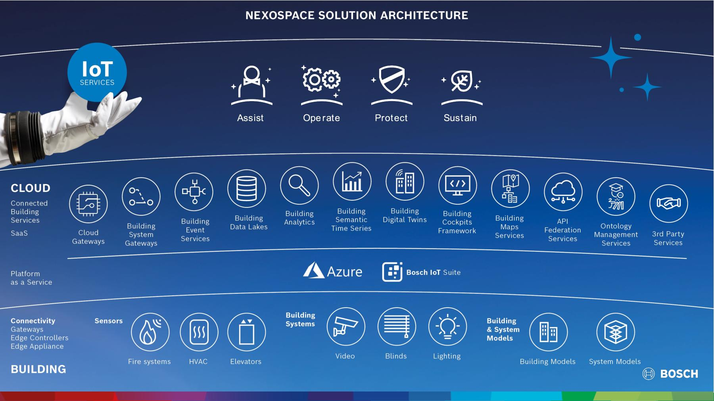

# Projects @ Bosch Building Technologies

>**Senior Solution Architect**
 
Munich, Germany
 
From `07.2015` to `Present`

>**Senior Software Engineer**
 
Singapore
 
From `08.2010` to `06.2015`

Bosch Building Technologies is an experienced system integrator helping buildings to be more secure, more efficient, and more comfortable.
Bosch BT mainly serves the domains such as video surveillance, intrusion detection, access control, fire detection, conferencing systems, and building automation systems.

# Nexospace Foundation Services

Foundation Services include the following Software-as-a-Service (SaaS) capabilities:

- Cloud Gateways
- Building System Gateways
- Building Event Services
- Building DataLakes
- Building Analytics
- Building Semantic Time Series
- Building Digital Twins
- Building Cockpit Framework
- Building Map Services
- API Federation Services
- Ontology Management Services

# Fire System Analyzer (FSA)

FSA is a service for customers who have Bosch Fire Alarm Systems. FSA is an important element in the fire and safety system portfolio and is integrating digital and remote services. FSA combines several use cases which are related to safety systems and is rooted in the BT Nexospace Program.

## Use Cases

- Health Monitoring
- Advanced Budget Prediction
- Detector Exchange Plan
- Digital Logbook

<iframe width="560" height="315" src="https://www.youtube.com/embed/ik-7GkfRzp0" title="Introduction of the new services: NEXOSPACE Cyber Security Guard and NEXOSPACE Fire System Analyzer" frameborder="0" allow="accelerometer; autoplay; clipboard-write; encrypted-media; gyroscope; picture-in-picture; web-share" allowfullscreen></iframe>

# Building Performance Analyzer and Optimizer

# Bosch Energy Services

https://www.boschbuildingsolutions.com/xc/en/energy-services/

# Remote Services - Next Gen

# Facility Management Assistant

https://www.boschservicesolutions.com/en/your-industry/buildings/

# Future of Conferencing Systems

# Indoor Localization using Sensor Fusion

# Gas Cylinder Detection using Cognitive Services

# Bosch Video Management System

<table style="width: 100%">
  <tr>
    <td><b>Location</b></td>
    <td>Munich, Germany</td>
  </tr>
  <tr>
    <td><b>Roles</b></td>
    <td>Software Architect, Scrum Master</td>
  </tr>
  <tr>
    <td><b>Software Development</b></td>
    <td>WPF, UWP, ASP.NET, SOAP, REST, RTC/SignalR, WCF, WebAPI</td>
  </tr>
</table>

## My Achievements

## Project Details

https://www.boschsecurity.com/de/de/loesungen/managementsoftware/bvms/
https://community.boschsecurity.com/t5/Security-Video/BVMS-System-design-guide/ta-p/3916

BVMS is a modular and resilient security system that aggregates and delivers consolidated data to security operators in a way that helps them make informed decisions – so they can trigger the right actions and deploy a swift response to improve security and safety. In addition, it ensures that data is available and secured at all times. Thanks to its scalability, BVMS grows with the user’s needs. From BVMS Viewer to Lite, Plus, Professional or Enterprise, it can easily be upgraded while keeping the same look and feel so that no further operator training is required.

BVMS Operator Client is an important component of the BVMS software which offers
- Live monitoring
- Storage retrieval and playback
- Forensic Search (post motion search)
- Alarm and accessing multiple Management Server computers simultaneously

# Project Endeavour

<table style="width: 100%">
  <tr>
    <td><b>Location</b></td>
    <td>Munich, Germany</td>
  </tr>
  <tr>
    <td><b>Roles</b></td>
    <td>Software Architect, Scrum Master</td>
  </tr>
  <tr>
    <td><b>Software Development</b></td>
    <td>WPF, UWP, Microsoft Prism, XAML, ASP.NET, SOAP, REST, RTC/SignalR, WCF, WebAPI, Entity Framework, Web Services Security, Claims Based Identity and Access Control</td>
  </tr>
</table>

## My Achievements

- Active part of the Global Software Architecture Group team for governance.
- Definitions and creation of technical software designs.
- Technology selections and Quality assurance (e.g. code reviews).
- Successfully provided guidance & mentoring within the Endeavour development team. 
- Conducting workshops to introduce coding and design best practices.
- Technology studies for new technical building blocks executed and successfully integrated into main stream development. 

## Project Details

Endeavour is the next generation security management software (NGSMS) from Bosch Security Systems. It delivers complete convergence of the security/safety domains such as Video, Access, Intrusion, Fire, Tracking, Public address.

Endeavour has a modularized, modern, open, service oriented and event driven software architecture based on industry standards, software platform vendor standards and modern state of the art software design structures and methods.

# Building Integration System (BIS)

<table style="width: 100%">
  <tr>
    <td><b>Location</b></td>
    <td>Singapore</td>
  </tr>
  <tr>
    <td><b>Role</b></td>
    <td>Senior Software Developer</td>
  </tr>
  <tr>
    <td><b>Technologies</b></td>
    <td>C#.NET, WCF, WinForms</td>
  </tr>
</table>

## My Achievements

- Integrated various Video-SDK versions from Bosch into BIS.
- Integrated video transcoding into Video Engine.
- Integrated Digital Video Recorder (DVR) and Video Recording Manager (VRM) into Video Engine.
- Implemented system monitor (CPU, Virtual memory etc.) to monitor performance of video system.
- Projects executed using agile methodologies (Feature Driven Development).

## Project Details

https://www.boschsecurity.com/xc/en/solutions/management-software/building-integration-system/
https://resources-boschsecurity-cdn.azureedge.net/public/documents/BIS_Data_sheet_enUS_63055878283.pdf

The Bosch Building Integration System (BIS) is a software solution that manages different Bosch security subsystems like access control, video surveillance, fire alarm, public address or intrusion systems on one single platform.

Besides, Bosch BIS offers a “tool box” to allow integration with third party applications via open standards and Software Development Kits (SDK).

