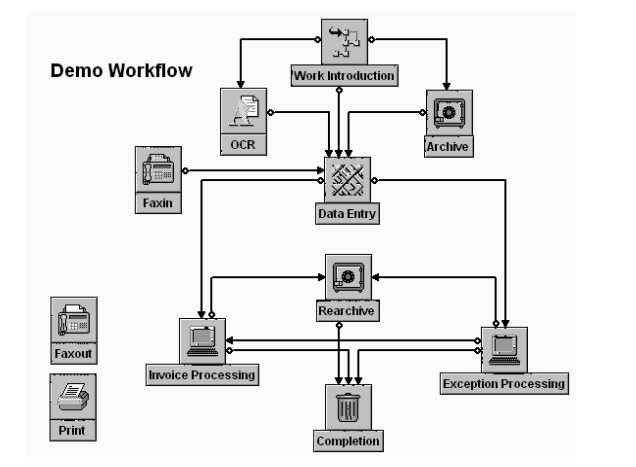
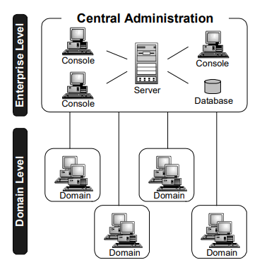
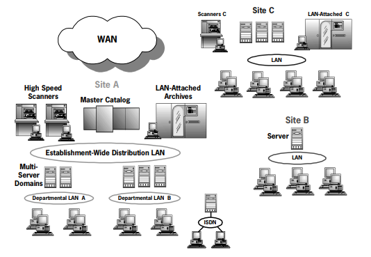

# Projects at Keane Inc.

Keane is a U.S. software services company delivering strategy, application management and development through delivery centers in India

During my employment at Keane Inc. between `08.2006` and `10.2008`, I worked on serveral projects. Some of the important one are listed below.

# Unisys – Client Satisfaction & Incident Survey (CSIS)

<table style="width: 100%">
  <tr>
    <td><b>Client</b></td>
    <td>Unisys</td>
  </tr>
  <tr>
    <td><b>Location</b></td>
    <td>Bangalore, India</td>
  </tr>
  <tr>
    <td><b>Roles</b></td>
    <td>Team Leader, Software Developer</td>
  </tr>
  <tr>
    <td><b>Technologies</b></td>
    <td>VB.NET, ASP.NET</td>
  </tr>
</table>

## My Responsibilities

- Team lead of a team of 6 people.
- Requirements analyzing and Proof of Concept development.
- Development of the new features and enhancements.
- Implementation and unit testing.

## Project Details

Unisys CSIS is a comprehensive survey system used for surveying the service provided by any organization. This involves:
- Customer Surveying
- Analyzing survey results
- Taking appropriate actions at the end of the survey
- Reporting the survey analysis

# Merrill Lynch Security and Provisioning Framework

<table style="width: 100%">
  <tr>
    <td><b>Client</b></td>
    <td>Merill Lynch</td>
  </tr>
  <tr>
    <td><b>Location</b></td>
    <td>Princeton, New Jersey, USA</td>
  </tr>
  <tr>
    <td><b>Role</b></td>
    <td>Software Developer</td>
  </tr>
  <tr>
    <td><b>Technologies</b></td>
    <td>C#.NET, ASP.NET</td>
  </tr>
</table>

## My Responsibilities

Designing the architecture according to the requirements
- Expanding the existing framework to include more functionalities
- Design of User Interface and Coding in .NET
- Implementation of Automotive Test applications and unit testing
- Bug Fixing and enhancements

## Project Details

Merrill Lynch Security and Provisioning Framework is a comprehensive security system which has multiple levels of security checks and is used for managing users involving.
- User Management
- Authorization
- Authentication

# Unisys InfoImage

<table style="width: 100%">
  <tr>
    <td><b>Client</b></td>
    <td>Unisys</td>
  </tr>
  <tr>
    <td><b>Location</b></td>
    <td>Bangalore, India</td>
  </tr>
  <tr>
    <td><b>Role</b></td>
    <td>Software Developer</td>
  </tr>
  <tr>
    <td><b>Technologies</b></td>
    <td>C, C++, VB, C#</td>
  </tr>
</table>

## My Responsibilities

- Proof of Concept development.
- User interface development.
- Feature implementation and unit testing.
- Debugging and bug fixing.

## Product Details

Unisys InfoImage is a comprehensive document management solution for capturing, indexing, storing and sharing information across the enterprise. Business documents can enter the system via high-speed scan, fax, or the Internet to create electronic documents.

Features include:
- Full administration from a centralized console,
- Modular components for easy customization,
- Microsoft VBA technology for fast performance and integration, and
- XML-based forms for Web performance.

The workflow solution has an easy point and click approach to creating
workflows without writing code, and routing workitems to designated
personnel for timely processing. 

### Workflow

Workflow is the movement of work under program control from workstep to workstep. The collection of worksteps, connections, rules, and statements that define the behavior of workitems is known as a route. The rules by which workitems move between the worksteps an

### Central Administration Console

The Central Administration Console runs from the Microsoft Management Console (MMC), a common user interface that serves as host to a variety of administrative tools. Two of these tools, the Administration and Operations Consoles, provide a central point of access where users can communicate with Workflow Domain Subsystems in multiple InfoImage Workflow Domains, while maintaining an enterprise level database. In addition, the Central Administration Console hosts other administrative consoles, such as XML Gateway and Enterprise Licensing. 

### Workflow Domain Subsystem Architecture

The Workflow Domain Subsystem software includes base processes and additional processes. The base processes are as follows:
- The Object Manager provides storage and management services for workitems resident at the Workflow Domain Subsystem.
- The Index Manager provides indexing services to support the File Cabinet.
- The Transfer Manager processes work on system worksteps, specifically, Archive, Delete, Transfer, and Request worksteps.
- The Route Engine handles the workflow on each server on the Workflow

Workitems are stored as files in a directory on the server. The directory must be on a Windows NTFS. 

### Request Manager

The Request Manager is an optional component that supports the processing of retrieval requests to a pool of Archive Managers. When a request is received, whether from a workstation or from a remote request, Request Manager sorts and prioritizes the pending tasks to achieve improvements in throughput at the Archive Manager. Specifically, it attempts to reduce the number of platter swaps within the jukebox and the number of imports and exports of platters (instead of handling the tasks using the FIFO queuing technique). 

### Location Manager

Program access to the Catalog software is controlled through a process called Location Manager. This program manages requests for information about records in the Catalog for all the servers and workstations in a Workflow Domain. Two examples of this program in action are when File Cabinet queries are sent to the archive and when Object Manager determines whether a workitem’s changes are archived before deleting the workitem from the Workflow Domain. For the Relational Catalog, Location Manager can run on any computer that has ODBC access to the Catalog database.

### Print Manager

The Print Manager provides a printer dedicated to image printing. The Print Manager consists of a computer running under Windows NT or Windows 2000, and Hewlett-Packard LaserJet or Windows compatible printer.

When you make a request to print a document, a spooled copy of the document is added to the print queue for the specified printer. The Print Manager periodically looks for work on this queue. When it finds work there, the software retrieves the document and decompresses and prints it. 

### Fax Manager

The Fax Manager supports both fax in and fax out of image documents. The Fax Manager software uses a GammaFax CP card and is installed in a Workflow Workflow Domain subsystem or a separate fax server. The card includes its own intelligent processor that off-loads much of the work from the server. A maximum of four cards can be installed on a single computer. 

### Server to Server Communication

With server-to-server connectivity, servers communicate with each other in a peer-to-peer network. An implicit assumption is that any server can communicate with any other server. The servers can use TCP/IP or APPC to communicate. 

