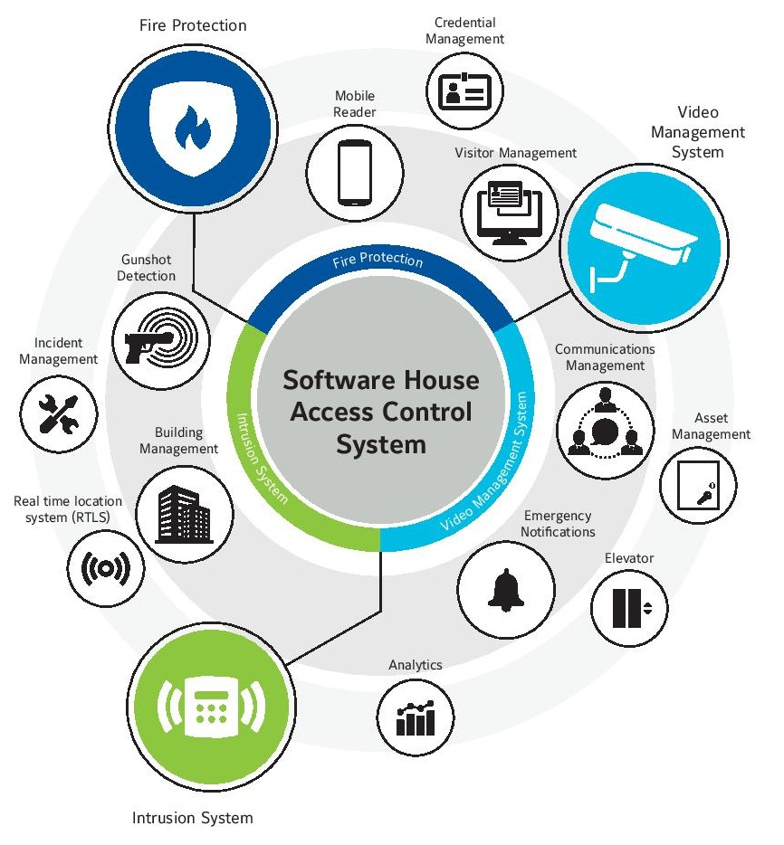

# Projects @ Tyco Fire and Security Pvt. Ltd.

Tyco is a leading provider of security products and services, fire protection and detection products and services, valves and controls, and other industrial products.

During my employment at Keane Inc. between `11.2008` and `07.2010`, I worked on serveral projects. Some of the important one are listed below.

## C•CURE 9000

Software House C•CURE® 9000 brings the best of physical and logical security together by integrating core access control functionality with a wide variety of business applications. 

Using standard IT tools and processes including Microsoft® .NET v3.5, web services, XML, SQL Server 2005, and Oracle 10g, C•CURE 9000 makes it easy for an IT professional to add it to the company’s network infrastructure. 

C•CURE 9000 delivers powerful security and event management functionality via an intuitive user interface that is similar to Microsoft’s Outlook® and Explorer with its easy navigation and tree structures. A practical application layout editor lets users drag and drop any application onto one screen and creates a customized hub for all activities via a single “command and control” center. 

No matter how distributed a business may be, C•CURE 9000 will help incorporate security throughout its enterprise, managing physical access control and other critical events from a virtual hub of integrated applications.

## DMP Intrusion Panel & Galaxy Intrusion Panel (by Honeywell) Integration

<table style="width: 100%">
  <tr>
    <td><b>Location</b></td>
    <td>Bangalore, India</td>
  </tr>
  <tr>
    <td><b>Role</b></td>
    <td>Software Developer</td>
  </tr>
  <tr>
    <td><b>Technologies</b></td>
    <td>C#.NET</td>
  </tr>
</table>

## My Responsibilities

- Proof of Concept development.
- Designing the integration architecture.
- Designing user interface and coding.
- Implementation of hardware integration protocol.
- Development and unit testing

## Project Details

https://www.swhouse.com/products/DMP-XR500-Integration.aspx
https://www.swhouse.com/products/Honeywell_Galaxy_Dimension_Integration.aspx 

Digital Monitoring Products (DMP) and Galaxy Integration involved integrating the following features of the DMP and Galaxy intrusion panel into the C•CURE 9000 software.
- Zones
- Areas
- Extension Devices
- Users
- User Profiles

The C•CURE 9000 software deals with interpreting the messages sent by the intrusion panel and displaying appropriate message in the monitoring application.

Also, C•CURE 9000 software is used for triggering some actions manually/automatically in the intrusion panel. For Example, disarming all the areas of the intrusion panel whenever a fire is detected in a fire detection system.

# iStar Controller Simulator

<table style="width: 100%">
  <tr>
    <td><b>Location</b></td>
    <td>Bangalore, India</td>
  </tr>
  <tr>
    <td><b>Role</b></td>
    <td>Software Developer</td>
  </tr>
  <tr>
    <td><b>Technologies</b></td>
    <td>C#.NET</td>
  </tr>
</table>

## My Responsibilities

- Proof of Concept development
- Designing the architecture
- Design user interface and Coding
- Using protocol for software interaction
- Implementation and unit testing

## Project Details

https://www.swhouse.com/products/hardware_istar.aspx
https://tyco-tsp.com/anz/iSTAR-Door-Controllers-detail.php

iStar Simulator emulates the iStar controller. It pumps data into any software which manages the iStar controller.

**Advantages:**
- Simulates hundreds of iStar controllers.  Hence saving the cost of actual hardware which might be required for scalability testing.
- Can be used to monitor system performance.

# Bosch Video Integration

<table style="width: 100%">
  <tr>
    <td><b>Location</b></td>
    <td>Bangalore, India</td>
  </tr>
  <tr>
    <td><b>Role</b></td>
    <td>Software Developer</td>
  </tr>
  <tr>
    <td><b>Technologies</b></td>
    <td>C#.NET</td>
  </tr>
</table>

## My Responsibilities

- Proof of Concept development
- Designing the architecture
- Design user interface and Coding
- Using protocol for hardware interaction
- Implementation and unit testing

## Project Details

https://www.swhouse.com/products/Bosch_VRM.aspx
https://www.boschsecurity.com/us/en/partners/technology-partners/meet-our-partners/partner-software-house/

The objective of this development is to integrate Bosch Video devices like Encoders and IP Cameras with the Access Control System. The integration is done using the software development kit of host software and Bosch. 

Bosch integration involved integrating the following features of the Bosch video cameras into the host software.
- Connect to IP Cameras
- Connect to Encoders
- Import camera configuration
- Perform camera operations such as PTZ, presets, mailing a snapshot, retrieving a recorded video etc.

In the monitoring application, user shall be able to view the signal state change messages for camera and the default messages for host software.