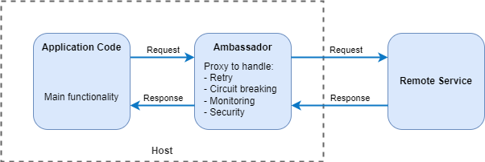
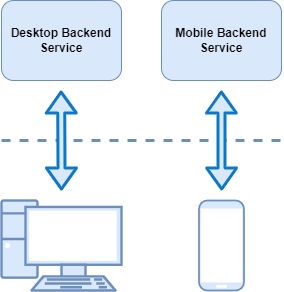
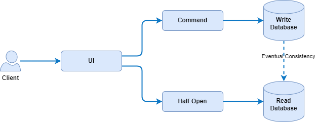

# Software Architecture

# Software Architecture Design Patterns

## Ambassador Pattern

Create helper services that send network requests on behalf of a consumer service or application. An ambassador service can be thought of as an out-of-process proxy that is co-located with the client.

This pattern can be useful for offloading common client connectivity tasks such as monitoring, logging, routing, security (such as TLS), and resiliency patterns in a language agnostic way. It is often used with legacy applications, or other applications that are difficult to modify, in order to extend their networking capabilities. It can also enable a specialized team to implement those features.

## Backend for Frontends Pattern

Create separate backend services to be consumed by specific frontend applications or interfaces. This pattern is useful when you want to avoid customizing a single backend for multiple interfaces. This pattern was first described by Sam Newman.

## Cache-Aside Pattern

Load data on demand into a cache from a data store. This can improve performance and also helps to maintain consistency between data held in the cache and data in the underlying data store.

## Circuit Breaker Pattern

Handle faults that might take a variable amount of time to recover from, when connecting to a remote service or resource. This can improve the stability and resiliency of an application.

## CQRS Pattern

CQRS stands for Command and Query Responsibility Segregation, a pattern that separates read and update operations for a data store. Implementing CQRS in your application can maximize its performance, scalability, and security. The flexibility created by migrating to CQRS allows a system to better evolve over time and prevents update commands from causing merge conflicts at the domain level.

## Federated Identity Pattern

Delegate authentication to an external identity provider. This can simplify development, minimize the requirement for user administration, and improve the user experience of the application.

An organization hosts a multi-tenant software as a service (SaaS) application in Microsoft Azure. The application includes a website that tenants can use to manage the application for their own users. The application allows tenants to access the website by using a federated identity that is generated by Active Directory Federation Services (AD FS) when a user is authenticated by that organization's own Active Directory.

## Gatekeeper Pattern

Protect applications and services by using a dedicated host instance to broker requests between clients and the application or service. The broker validates and sanitizes the requests, and can provide an additional layer of security and limit the system's attack surface.

## Health Endpoint Monitoring

To verify that applications and services are performing correctly, you can use the Health Endpoint Monitoring pattern. This pattern specifies the use of functional checks in an application. External tools can access these checks at regular intervals through exposed endpoints.

## Leader Election Pattern

Coordinate the actions performed by a collection of collaborating instances in a distributed application by electing one instance as the leader that assumes responsibility for managing the others. This can help to ensure that instances don't conflict with each other, cause contention for shared resources, or inadvertently interfere with the work that other instances are performing.

## Materialized View Pattern

Generate prepopulated views over the data in one or more data stores when the data isn't ideally formatted for required query operations. This can help support efficient querying and data extraction, and improve application performance.

## Publisher / Subscriber Pattern

Enable an application to announce events to multiple interested consumers asynchronously, without coupling the senders to the receivers.

## Sharding Pattern

Divide a data store into a set of horizontal partitions or shards. This can improve scalability when storing and accessing large volumes of data.

## Sidecar Pattern

Deploy components of an application into a separate process or container to provide isolation and encapsulation. This pattern can also enable applications to be composed of heterogeneous components and technologies.

This pattern is named Sidecar because it resembles a sidecar attached to a motorcycle. In the pattern, the sidecar is attached to a parent application and provides supporting features for the application. The sidecar also shares the same lifecycle as the parent application, being created and retired alongside the parent. The sidecar pattern is sometimes referred to as the sidekick pattern and is a decomposition pattern.

