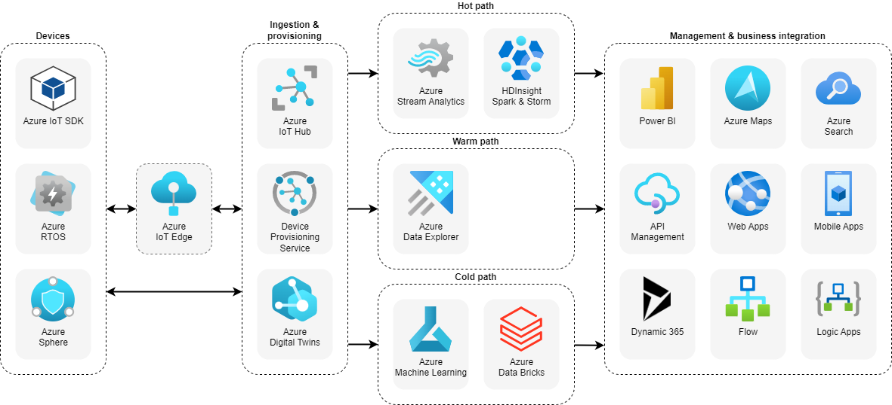
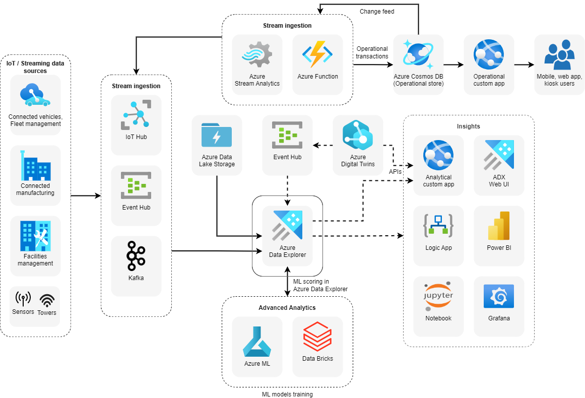
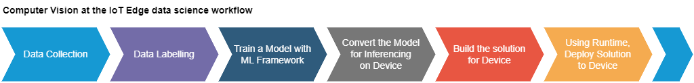
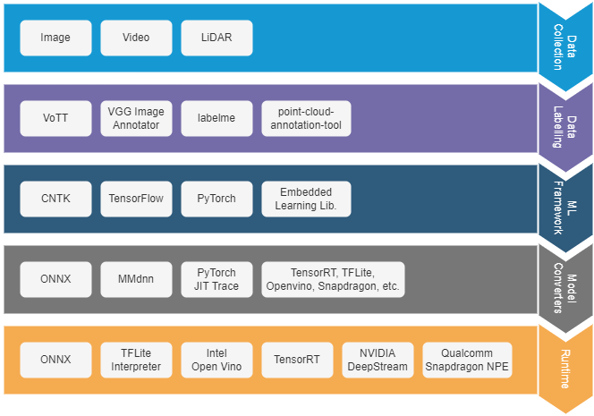
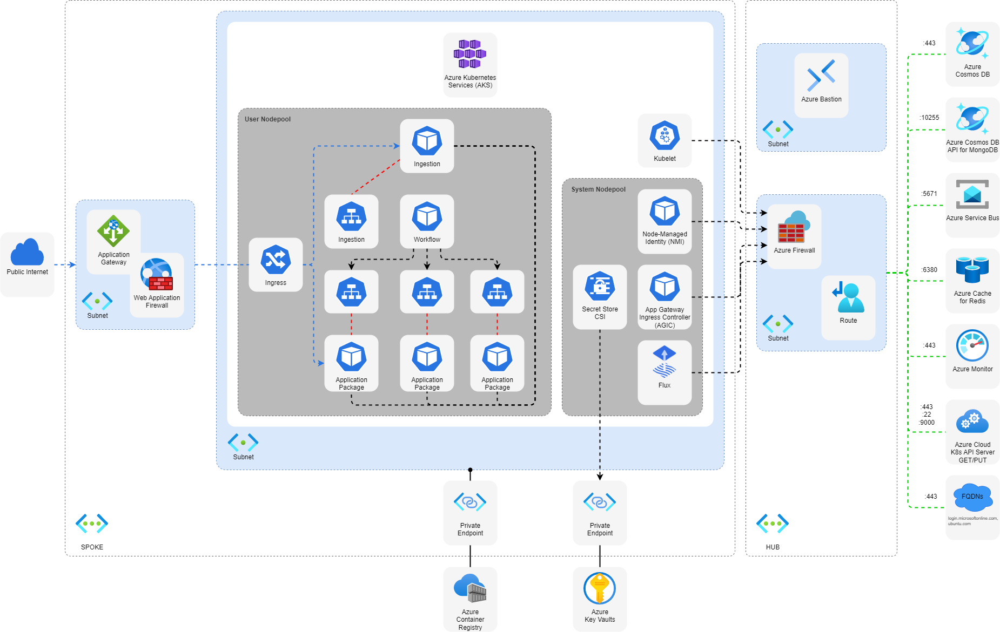
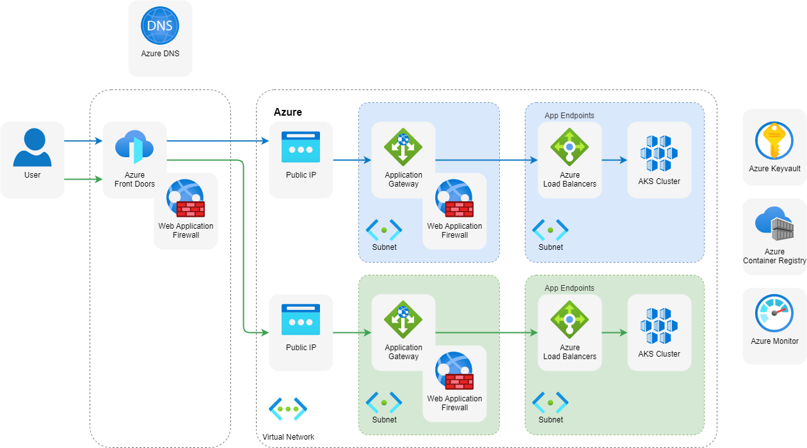

# Solution Architecture

Solution architecture is a practice to provide ground for software development projects by tailoring IT solutions to specific business needs and defining their functional requirements and stages of implementation. Solution architecture is the means to execute or realise a technology strategy.

In this section you will find solution architecture diagrams and technology descriptions for reference architectures, real world examples of cloud architectures, and solution ideas for common workloads.

# Solution Architecture Snippets

## IoT Reference Architecture

## IoT Application-to-Device Commands

## Event Driven Architecture

An event-driven architecture consists of event producers that generate a stream of events, and event consumers that listen for the events.

## Serverless Event Processing

This reference architecture shows a serverless, event-driven architecture that ingests a stream of data, processes the data, and writes the results to a back-end database.

## IoT analytics with Azure Data Explorer

## Machine Learning in Azure IoT Edge Vision AI

## Azure Kubernetes Service (AKS) Microservices Architecture

## Blue-Green Deployment of AKS Clusters

<!-- # References

- https://learn.microsoft.com/en-us/azure/architecture/reference-architectures/iot
- https://learn.microsoft.com/en-us/azure/architecture/solution-ideas/articles/iot-azure-data-explorer
- https://learn.microsoft.com/en-us/azure/architecture/guide/iot-edge-vision/machine-learning
- https://learn.microsoft.com/en-us/azure/architecture/example-scenario/iot/cloud-to-device
- https://learn.microsoft.com/en-us/azure/architecture/guide/architecture-styles/event-driven
- https://learn.microsoft.com/en-us/azure/architecture/reference-architectures/serverless/event-processing
- https://learn.microsoft.com/en-us/azure/architecture/reference-architectures/containers/aks-microservices/aks-microservices-advanced
- https://learn.microsoft.com/en-us/azure/architecture/guide/aks/blue-green-deployment-for-aks -->