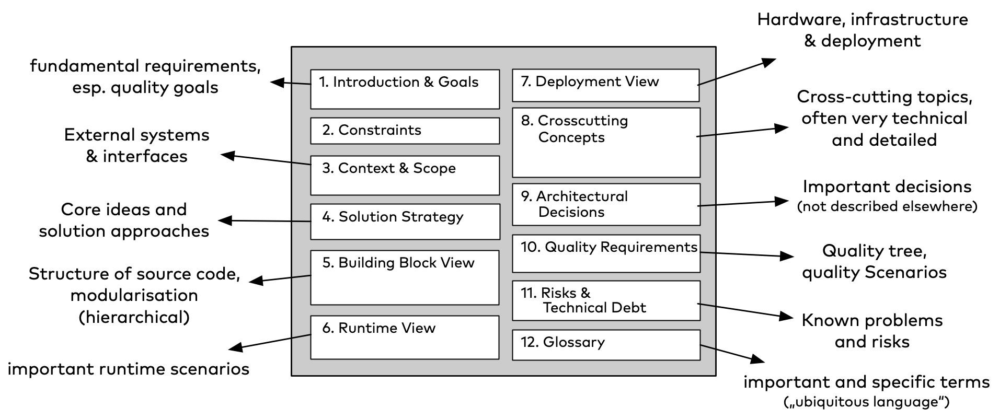
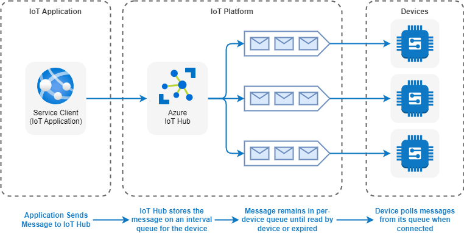

# Solution Architecture

# arc42 - Software Architecture Methodology

arc42 - the template for effective, practical and pragmatic software architecture documentation and communication. arc42 has a clear, simple and effective structure to document and communicate your software system. It is optimized for understandability and adequacy. arc42 naturally guides you to explain any kind of architecture information or decision in an understandable way, easy to maintain.

arc42 answers the following two questions in a pragmatic way and can be tailored to your specific needs:

- What should you document/communicate about your architecture?
- How should you document/communicate?

## 1. Introduction and Goals

Short description of the requirements, driving forces, extract (or abstract) of requirements. Top three (max five) quality goals for the architecture which have highest priority for the major stakeholders. A table of important stakeholders with their expectation regarding architecture.

## 2. Constraints

Anything that constrains teams in design and implementation decisions or decision about related processes. Can sometimes go beyond individual systems and are valid for whole organizations and companies.

## 3. Context and Scope

Delimits your system from its (external) communication partners (neighboring systems and users). Specifies the external interfaces. Shown from a business/domain perspective (always) or a technical perspective (optional)

## 4. Solution Strategy

Summary of the fundamental decisions and solution strategies that shape the architecture. Can include technology, top-level decomposition, approaches to achieve top quality goals and relevant organizational decisions.

## 5. Building Block View

Static decomposition of the system, abstractions of source-code, shown as hierarchy of white boxes (containing black boxes), up to the appropriate level of detail.

## 6. Runtime View

Behavior of building blocks as scenarios, covering important use cases or features, interactions at critical external interfaces, operation and administration plus error and exception behavior.

## 7. Deployment View

Technical infrastructure with environments, computers, processors, topologies. Mapping of (software) building blocks to infrastructure elements.

## 8. Crosscutting Concepts

Overall, principal regulations and solution approaches relevant in multiple parts (→ cross-cutting) of the system. Concepts are often related to multiple building blocks. Include different topics like domain models, architecture patterns and -styles, rules for using specific technology and implementation rules.

## 9. Architectural Decisions

Important, expensive, critical, large scale or risky architecture decisions including rationales.

## 10. Quality Requirements

Quality requirements as scenarios, with quality tree to provide high-level overview. The most important quality goals should have been described in section 1.2. (quality goals).

## 11. Risks and Technical Debt

Known technical risks or technical debt. What potential problems exist within or around the system? What does the development team feel miserable about?

## 12. Glossary

Important domain and technical terms that stakeholders use when discussing the system. Also: translation reference if you work in a multi-language environment.

# Solution Architecture Snippets

## IoT Reference Architecture

## IoT analytics with Azure Data Explorer

## Machine learning in Azure IoT Edge vision AI

## IoT application-to-device commands

## Event Driven Architecture

An event-driven architecture consists of event producers that generate a stream of events, and event consumers that listen for the events.

## Serverless event processing
++
This reference architecture shows a serverless, event-driven architecture that ingests a stream of data, processes the data, and writes the results to a back-end database.

## Azure Kubernetes Service (AKS) microservices architecture

## Blue-green deployment of AKS clusters

# References
- https://www.arc42.org
- https://learn.microsoft.com/en-us/azure/architecture/reference-architectures/iot
- https://learn.microsoft.com/en-us/azure/architecture/solution-ideas/articles/iot-azure-data-explorer
- https://learn.microsoft.com/en-us/azure/architecture/guide/iot-edge-vision/machine-learning
- https://learn.microsoft.com/en-us/azure/architecture/example-scenario/iot/cloud-to-device
- https://learn.microsoft.com/en-us/azure/architecture/guide/architecture-styles/event-driven
- https://learn.microsoft.com/en-us/azure/architecture/reference-architectures/serverless/event-processing
- https://learn.microsoft.com/en-us/azure/architecture/reference-architectures/containers/aks-microservices/aks-microservices-advanced
- https://learn.microsoft.com/en-us/azure/architecture/guide/aks/blue-green-deployment-for-aks